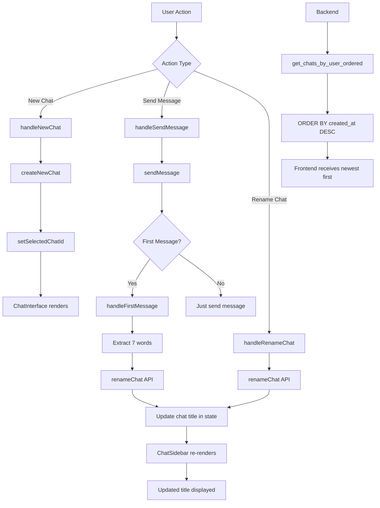

# Chat UI Improvements Plan

## Overview

This plan addresses 5 improvements to the chat interface:
1. Add scrolling in the chat column section
2. Fix navigation to new chat after document selection
3. Show chat sessions as newest first
4. Auto-rename chat with first 7 words of first query
5. Add manual rename button for chat sessions

---

## Issue 1: Add Scrolling in Chat Column Section

**Current State:**
- [`ChatSidebar.tsx`](frontend/components/ChatSidebar.tsx:50) already has a `ScrollArea` component wrapping the chat list
- [`page.tsx`](frontend/app/page.tsx:63) has a div with `overflow-y-auto` for the sidebar container
- The scrolling may not be working properly due to conflicting overflow settings

**Root Cause:**
The sidebar container in [`page.tsx:63`](frontend/app/page.tsx:63) has `overflow-y-auto` which may conflict with the `ScrollArea` component inside `ChatSidebar`.

**Solution:**
Remove `overflow-y-auto` from the sidebar container in [`page.tsx`](frontend/app/page.tsx:63) and let the `ScrollArea` component handle scrolling internally.

**Files to Modify:**
- [`frontend/app/page.tsx`](frontend/app/page.tsx:63)

---

## Issue 2: New Chat Navigation After Document Selection

**Current State:**
- [`handleNewChat`](frontend/app/page.tsx:41-44) in `page.tsx` calls `setSelectedChatId(newChat.id)` after creating a chat
- [`handleConfirmDocumentSelection`](frontend/components/ChatSidebar.tsx:36-40) calls `onNewChat(selectedDocumentIds)` and closes the modal
- The chat should be selected, but there may be a timing issue or the chat list isn't refreshing

**Root Cause:**
The `useChats` hook adds the new chat to the state with `setChats((prev) => [newChat, ...prev])`, but the `selectedChatId` is set before the state update completes. This could cause a race condition.

**Solution:**
Ensure the chat is properly added to the state before selecting it. The current implementation should work, but we should verify the flow and add any necessary state synchronization.

**Files to Modify:**
- [`frontend/app/page.tsx`](frontend/app/page.tsx:41-44) - Verify and potentially adjust the flow

---

## Issue 3: Show Chat Sessions as Newest First

**Current State:**
- [`useChats.ts`](frontend/hooks/useChats.ts:26) prepends new chats: `setChats((prev) => [newChat, ...prev])`
- When fetching from API, the order depends on backend response
- Backend [`get_chats_by_user`](controllers/chat.py:15-48) doesn't specify an ORDER BY clause

**Root Cause:**
The backend doesn't guarantee the order of chats when fetching. The frontend prepends new chats locally, but on refresh, the order depends on the database query.

**Solution:**
1. **Backend:** Add `ORDER BY created_at DESC` to the backend query in [`controllers/chat.py:32`](controllers/chat.py:32)
2. **Frontend:** Ensure the frontend maintains the newest-first order when displaying

**Files to Modify:**
- [`controllers/chat.py`](controllers/chat.py:32) - Add ORDER BY clause
- [`layers/dao/chats_dao.py`](layers/dao/chats_dao.py) - Update DAO method if needed

---

## Issue 4: Auto-Rename Chat with First 7 Words of First Query

**Current State:**
- Backend has a rename endpoint at `/chats/{chat_id}/rename` ([`controllers/chat.py:82-112`](controllers/chat.py:82-112))
- Frontend doesn't have logic to detect the first message and auto-rename
- Chat titles default to "New Chat" or "Untitled Chat"

**Solution:**
1. **Frontend:** In [`useMessages.ts`](frontend/hooks/useMessages.ts), detect when the first message is sent
2. **Frontend:** Extract the first 7 words from the query
3. **Frontend:** Call the rename API to update the chat title
4. **Frontend:** Update the chat title in the local state

**Implementation Details:**
- Check if the current message count is 1 (first message)
- Extract first 7 words: `query.split(' ').slice(0, 7).join(' ')`
- Call rename API
- Update the chat in the chats list

**Files to Modify:**
- [`frontend/hooks/useMessages.ts`](frontend/hooks/useMessages.ts) - Add auto-rename logic
- [`frontend/hooks/useChats.ts`](frontend/hooks/useChats.ts) - Add updateChatTitle function
- [`frontend/lib/api.ts`](frontend/lib/api.ts) - Add renameChat function (needs to be created)

---

## Issue 5: Add Manual Rename Button for Chat Sessions

**Current State:**
- Backend already has a rename endpoint at `/chats/{chat_id}/rename` ([`controllers/chat.py:82-112`](controllers/chat.py:82-112))
- Frontend doesn't have any rename UI
- Existing plan in [`plans/chat_rename_and_query_persistence_fixes.md`](plans/chat_rename_and_query_persistence_fixes.md) covers this

**Solution:**
Implement the rename UI as outlined in the existing plan:
1. Add a rename button (pencil icon) next to the delete button
2. Allow double-click on chat title to edit
3. Show input field when editing
4. Save on Enter, cancel on Escape

**Files to Modify:**
- [`frontend/lib/api.ts`](frontend/lib/api.ts) - Add renameChat function (needs to be created)
- [`frontend/hooks/useChats.ts`](frontend/hooks/useChats.ts) - Add renameChat function
- [`frontend/components/ChatSidebar.tsx`](frontend/components/ChatSidebar.tsx) - Add rename UI
- [`frontend/app/page.tsx`](frontend/app/page.tsx) - Pass renameChat handler

---

## Implementation Steps

### Step 1: Create Missing API Layer File

**File:** [`frontend/lib/api.ts`](frontend/lib/api.ts) (NEW FILE)

Create the API layer file with all necessary functions:
- `fetchChatsByUser`
- `createChat`
- `deleteChat`
- `renameChat`
- `fetchMessagesByChat`
- `sendQuery`
- `fetchCompanies`
- `fetchUsers`
- `fetchUsersByCompany`
- `fetchDocumentsByCompany`

---

### Step 2: Fix Chat Column Scrolling

**File:** [`frontend/app/page.tsx`](frontend/app/page.tsx:63)

Change:
```tsx
<div className="w-80 flex-shrink-0 border-r overflow-y-auto">
```

To:
```tsx
<div className="w-80 flex-shrink-0 border-r flex flex-col">
```

---

### Step 3: Fix Backend Chat Ordering

**File:** [`controllers/chat.py`](controllers/chat.py:32)

Update the query to include ORDER BY:
```python
chats = chat_dao.get_chats_by_user(user_id)
```

To:
```python
chats = chat_dao.get_chats_by_user_ordered(user_id)
```

**File:** [`layers/dao/chats_dao.py`](layers/dao/chats_dao.py)

Add new method or update existing:
```python
def get_chats_by_user_ordered(self, user_id: UUID) -> List[Chat]:
    return self.session.exec(
        select(Chat)
        .where(Chat.user_id == user_id)
        .order_by(Chat.created_at.desc())
    ).all()
```

---

### Step 4: Add Auto-Rename Logic to useMessages

**File:** [`frontend/hooks/useMessages.ts`](frontend/hooks/useMessages.ts)

Add a callback to detect first message and rename:
```tsx
const sendMessage = async (userId: string, query: string, onFirstMessage?: (query: string) => void) => {
  if (!chatId) throw new Error('No chat selected');
  setSending(true);
  try {
    // Check if this is the first message
    const isFirstMessage = messages.length === 0;
    
    // ... existing message sending logic ...
    
    // If this was the first message, trigger auto-rename
    if (isFirstMessage && onFirstMessage) {
      onFirstMessage(query);
    }
    
    return response;
  } catch (err) {
    // ... error handling ...
  } finally {
    setSending(false);
  }
};
```

---

### Step 5: Add Rename Functions to useChats

**File:** [`frontend/hooks/useChats.ts`](frontend/hooks/useChats.ts)

Add rename and update functions:
```tsx
const renameChat = async (chatId: string, newTitle: string) => {
  const updatedChat = await renameChat(chatId, newTitle);
  setChats((prev) => prev.map((c) => (c.id === chatId ? updatedChat : c)));
};

const updateChatTitle = (chatId: string, newTitle: string) => {
  setChats((prev) => prev.map((c) => (c.id === chatId ? { ...c, title: newTitle } : c)));
};
```

---

### Step 6: Add Rename UI to ChatSidebar

**File:** [`frontend/components/ChatSidebar.tsx`](frontend/components/ChatSidebar.tsx)

Add state and UI for renaming:
- Add `editingChatId` and `editingTitle` state
- Add rename button (pencil icon)
- Add double-click handler on title
- Add input field for editing
- Add save/cancel handlers

---

### Step 7: Update page.tsx to Handle Auto-Rename

**File:** [`frontend/app/page.tsx`](frontend/app/page.tsx)

Add auto-rename handler:
```tsx
const handleFirstMessage = async (query: string) => {
  if (!selectedChatId) return;
  const first7Words = query.split(' ').slice(0, 7).join(' ');
  await renameChat(selectedChatId, first7Words);
};
```

Update `handleSendMessage`:
```tsx
const handleSendMessage = async (query: string) => {
  if (!selectedUser) return;
  await sendMessage(selectedUser.id, query, handleFirstMessage);
};
```

---

## Testing Checklist

### Scrolling
- [ ] Chat sidebar scrolls properly when there are many chats
- [ ] Scrollbar appears when needed
- [ ] No double scrollbars

### New Chat Navigation
- [ ] After selecting documents and creating chat, the new chat is automatically selected
- [ ] Chat interface shows the new chat immediately
- [ ] No need to manually click on the new chat

### Newest First Ordering
- [ ] Newest chats appear at the top of the list
- [ ] After page refresh, order is maintained
- [ ] Newly created chats appear at the top

### Auto-Rename
- [ ] First message triggers auto-rename
- [ ] Chat title is updated to first 7 words of first query
- [ ] Title updates in the sidebar immediately
- [ ] Works correctly after page refresh

### Manual Rename
- [ ] Rename button appears next to delete button
- [ ] Clicking rename shows input field
- [ ] Double-clicking title shows input field
- [ ] Enter saves the new title
- [ ] Escape cancels editing
- [ ] Clicking outside saves the new title
- [ ] Empty title is not saved

---

## Files to Modify

1. **NEW:** [`frontend/lib/api.ts`](frontend/lib/api.ts) - Create API layer
2. [`frontend/app/page.tsx`](frontend/app/page.tsx) - Fix scrolling, add auto-rename handler
3. [`frontend/hooks/useMessages.ts`](frontend/hooks/useMessages.ts) - Add first message detection
4. [`frontend/hooks/useChats.ts`](frontend/hooks/useChats.ts) - Add rename functions
5. [`frontend/components/ChatSidebar.tsx`](frontend/components/ChatSidebar.tsx) - Add rename UI
6. [`controllers/chat.py`](controllers/chat.py) - Update chat ordering
7. [`layers/dao/chats_dao.py`](layers/dao/chats_dao.py) - Add ordered query method

---

## Architecture Diagram



---

## Notes

- The `lib/api.ts` file is missing and needs to be created with all API functions
- The auto-rename feature should only trigger on the first message of a chat
- The manual rename feature should work at any time
- Chat ordering should be consistent between frontend state and backend queries
- Consider adding a loading state for rename operations
- The rename API endpoint expects the new title as a query parameter or request body - verify the exact format
