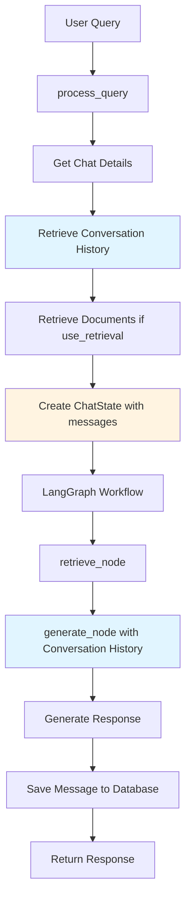

# Conversation Context Implementation Plan

## Overview
This plan outlines the implementation of conversation context awareness in the chat message response system. Currently, each query is processed independently without considering previous messages in the conversation. The goal is to enable the LLM to maintain context across the entire conversation history.

## Current State Analysis

### Existing Implementation
- **File**: [`services/chat_messages.py`](services/chat_messages.py)
- **Method**: [`process_query()`](services/chat_messages.py:263)
- **Workflow**: Uses LangGraph with two nodes:
  1. `retrieve_node` - Retrieves relevant documents
  2. `generate_node` - Generates LLM response

### Current Limitations
1. The [`ChatState`](services/chat_messages.py:34) has a `messages` field but it's always empty
2. The [`generate_node`](services/chat_messages.py:69) only uses the current query and retrieved context
3. No conversation history is passed to the LLM
4. Each query is processed in isolation

## Implementation Plan

### Step 1: Add Conversation History Retrieval Method
**File**: [`services/chat_messages.py`](services/chat_messages.py)

Add a new method to retrieve and format conversation history:

```python
def _get_conversation_history(
    self, 
    chat_id: UUID, 
    max_history: int = 10
) -> List[BaseMessage]:
    """
    Retrieve and format conversation history for a chat.
    
    Args:
        chat_id: ID of the chat
        max_history: Maximum number of previous messages to include
        
    Returns:
        List of LangChain BaseMessage objects (HumanMessage and AIMessage)
    """
    # Get previous messages ordered by creation time
    previous_messages = self.chat_message_dao.get_messages_by_chat_ordered(chat_id)
    
    # Limit to max_history messages
    previous_messages = previous_messages[-max_history:] if len(previous_messages) > max_history else previous_messages
    
    # Convert to LangChain messages
    conversation_history = []
    for msg in previous_messages:
        # Add user query as HumanMessage
        conversation_history.append(HumanMessage(content=msg.chat_query))
        
        # Add AI response as AIMessage (if exists)
        if msg.response:
            conversation_history.append(AIMessage(content=msg.response))
    
    return conversation_history
```

### Step 2: Update ChatState (Already Has messages Field)
**File**: [`services/chat_messages.py`](services/chat_messages.py)

The [`ChatState`](services/chat_messages.py:34) already has a `messages` field:
```python
class ChatState(TypedDict):
    query: str
    context: List[Dict[str, Any]]
    response: str
    llm_model: str
    llm_provider: str
    llm_config: Dict[str, Any]
    messages: Annotated[List[BaseMessage], "messages"]  # Already exists
```

No changes needed to the state definition.

### Step 3: Modify generate_node to Use Conversation History
**File**: [`services/chat_messages.py`](services/chat_messages.py)

Update the [`generate_node`](services/chat_messages.py:69) function to include conversation history:

```python
async def generate_node(state: ChatState) -> ChatState:
    """Generate response using the LLM with conversation context."""
    llm = self._get_llm(
        state["llm_provider"],
        state["llm_model"],
        state.get("llm_config", {})
    )
    
    # Format context documents
    context_text = ""
    if state["context"]:
        context_text = "\n\n".join([
            f"Document {i+1}: {doc.get('content', '')}"
            for i, doc in enumerate(state["context"])
        ])
    
    # Build messages list with conversation history
    messages = []
    
    # Add system message
    system_prompt = "You are a helpful assistant."
    if context_text:
        system_prompt += " Use the following context to answer the user's question."
    messages.append(("system", system_prompt))
    
    # Add conversation history (if any)
    if state["messages"]:
        messages.extend(state["messages"])
    
    # Add current query with context
    current_query = f"{context_text}\n\nQuestion: {state['query']}" if context_text else state["query"]
    messages.append(("human", current_query))
    
    # Create prompt with messages
    prompt = ChatPromptTemplate.from_messages(messages)
    
    # Generate response
    chain = prompt | llm | StrOutputParser()
    response = chain.invoke({})
    
    state["response"] = response
    return state
```

### Step 4: Update process_query to Populate Conversation History
**File**: [`services/chat_messages.py`](services/chat_messages.py)

Update the [`process_query`](services/chat_messages.py:263) method to retrieve and include conversation history:

```python
async def process_query(
    self, 
    query_request: ChatQueryRequest
) -> ChatQueryResponse:
    """
    Process a chat query using LangGraph workflow with conversation context.
    
    Args:
        query_request: Query request with chat_id, query, and options
        
    Returns:
        Query response with message details
        
    Raises:
        ValueError: If chat_id or query is not provided, or chat doesn't exist
    """
    if not query_request.chat_id:
        raise ValueError("chat_id is required")
    
    if not query_request.query or not query_request.query.strip():
        raise ValueError("query is required and cannot be empty")
    
    # Get chat details
    chat = self.chat_dao.get_chat_by_id(query_request.chat_id)
    if not chat:
        raise ValueError(f"Chat with ID {query_request.chat_id} not found")
    
    # Determine LLM model and provider
    llm_model = query_request.llm_model
    llm_provider = query_request.llm_provider
    llm_config = {}
    
    # If not specified, get from company settings
    if not llm_model or not llm_provider:
        if chat.company_id:
            llm_config = self.company_dao.get_llm_config(chat.company_id)
            if llm_config:
                llm_provider = llm_provider or llm_config.get("llm_provider", "openai")
                llm_model = llm_model or llm_config.get("llm_model", "gpt-4")
    
    # Default values
    llm_provider = llm_provider or "openai"
    llm_model = llm_model or "gpt-4"
    
    # Retrieve documents if requested
    context_documents = []
    if query_request.use_retrieval:
        context_documents = self._retrieve_documents(
            query=query_request.query,
            user_id=chat.user_id,
            company_id=chat.company_id,
            top_k=query_request.top_k
        )
    
    # Get conversation history
    conversation_history = self._get_conversation_history(
        chat_id=query_request.chat_id,
        max_history=10  # Configurable limit
    )
    
    # Create state for LangGraph
    state = ChatState(
        query=query_request.query,
        context=context_documents,
        response="",
        llm_model=llm_model,
        llm_provider=llm_provider,
        llm_config=llm_config,
        messages=conversation_history  # Populate with conversation history
    )
    
    # Run the workflow
    result = await self.workflow.ainvoke(state)
    
    # Create chat message
    new_message = ChatMessage(
        chat_id=query_request.chat_id,
        chat_query=query_request.query,
        context_document={"documents": context_documents} if context_documents else None,
        response=result["response"],
        created_at=get_current_utc_time()
    )
    
    # Save to database
    created_message = self.chat_message_dao.create_chat_message(new_message)
    
    # Return response
    return ChatQueryResponse(
        message_id=created_message.id,
        chat_id=created_message.chat_id,
        query=created_message.chat_query,
        response=created_message.response or "",
        context_documents=context_documents,
        created_at=created_message.created_at.isoformat(),
        llm_model=llm_model,
        llm_provider=llm_provider
    )
```

### Step 5: Optional - Add Configuration for Conversation History Limit
**File**: [`layers/schemas.py`](layers/schemas.py)

Add a new field to [`ChatQueryRequest`](layers/schemas.py:243) to allow clients to control conversation history:

```python
class ChatQueryRequest(BaseModel):
    """Schema for chat query request."""
    chat_id: UUID
    query: str
    use_retrieval: bool = True
    top_k: int = 5
    llm_model: Optional[str] = None
    llm_provider: Optional[str] = None
    max_history: int = 10  # Maximum number of previous messages to include in context
```

## Architecture Diagram



## Key Changes Summary

| Component | Change | Purpose |
|-----------|--------|---------|
| [`ChatMessageService`](services/chat_messages.py:45) | Add `_get_conversation_history()` method | Retrieve and format previous messages |
| [`generate_node`](services/chat_messages.py:69) | Update to use `state["messages"]` | Include conversation history in prompt |
| [`process_query`](services/chat_messages.py:263) | Populate `messages` field | Pass conversation history to workflow |
| [`ChatQueryRequest`](layers/schemas.py:243) | Add `max_history` field | Allow configurable history limit |

## Benefits

1. **Context Awareness**: The LLM can reference previous messages in the conversation
2. **Follow-up Questions**: Users can ask follow-up questions without repeating context
3. **Natural Conversation**: More human-like interaction flow
4. **Configurable**: Clients can control how much history to include
5. **Backward Compatible**: Existing functionality remains unchanged

## Testing Considerations

1. Test with empty conversation history (first message)
2. Test with single previous message
3. Test with multiple previous messages
4. Test with `max_history` limit
5. Test with and without document retrieval
6. Verify conversation flow across multiple queries

## Implementation Order

1. Add `_get_conversation_history()` method
2. Update `generate_node()` to use conversation history
3. Update `process_query()` to populate conversation history
4. (Optional) Add `max_history` field to schema
5. Test the implementation
