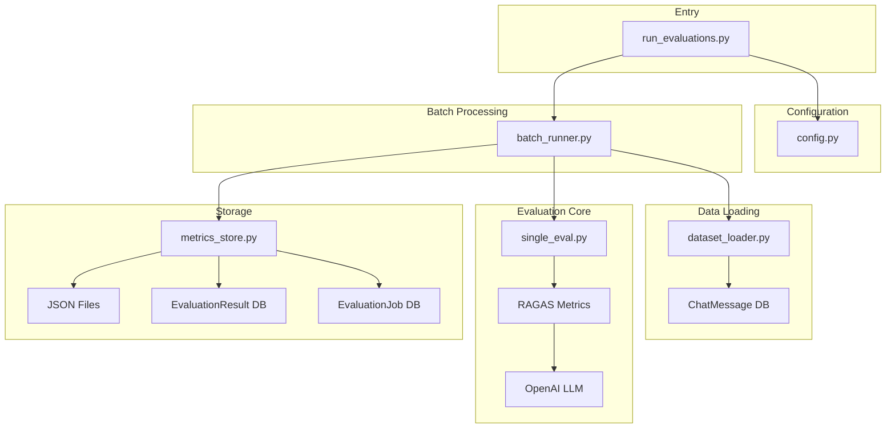
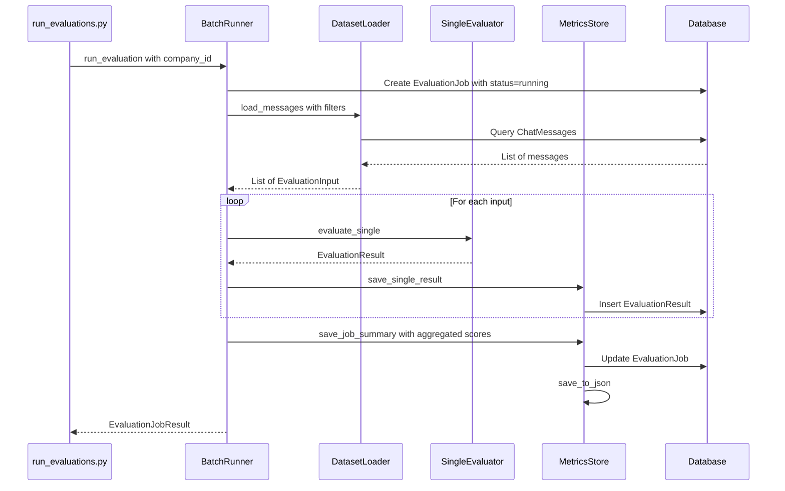
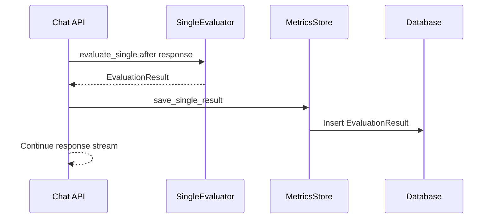

# RAGAS Evaluation Pipeline Architecture

## Overview

This document outlines the architecture for a RAGAS-based evaluation pipeline for the Basic_RAG system. The pipeline supports both batch evaluation and per-query evaluation modes, with results stored in both JSON files and database tables.

## Requirements Summary

- **Data Source**: ChatMessage database (primary)
- **Metrics**: Faithfulness, Answer Relevance, Context Precision (no ground truth required)
- **Scope**: Company-scoped evaluations
- **Output**: Per-query scores + aggregated job scores
- **Storage**: JSON files + PostgreSQL database

---

## Architecture Diagram



---

## Database Schema

### New Tables

#### 1. EvaluationJob

Tracks each batch evaluation run.

| Column | Type | Description |
|--------|------|-------------|
| id | UUID | Primary key |
| company_id | UUID | FK to companies.id |
| status | str | pending, running, completed, failed |
| total_queries | int | Total number of queries evaluated |
| avg_faithfulness | float | Average faithfulness score |
| avg_answer_relevance | float | Average answer relevance score |
| avg_context_precision | float | Average context precision score |
| overall_score | float | Weighted average of all metrics |
| started_at | datetime | When evaluation started |
| completed_at | datetime | When evaluation completed |
| error_message | str | Error details if failed |
| config_snapshot | JSONB | Configuration used for this job |
| created_at | datetime | Record creation timestamp |

#### 2. EvaluationResult

Stores per-query evaluation scores.

| Column | Type | Description |
|--------|------|-------------|
| id | UUID | Primary key |
| job_id | UUID | FK to evaluation_jobs.id |
| chat_message_id | UUID | FK to chat_messages.id |
| company_id | UUID | FK to companies.id |
| question | str | The user query |
| retrieved_contexts | JSONB | List of retrieved document contents |
| answer | str | The generated response |
| faithfulness_score | float | Faithfulness metric score |
| answer_relevance_score | float | Answer relevance metric score |
| context_precision_score | float | Context precision metric score |
| overall_score | float | Average of all metric scores |
| evaluation_metadata | JSONB | Additional metadata |
| created_at | datetime | Record creation timestamp |

---

## Module Design

### 1. config.py

Configuration management for evaluation settings.

```python
# Key configurations
EVALUATION_CONFIG = {
    # OpenAI settings
    "llm_model": "gpt-4",
    "llm_provider": "openai",
    
    # RAGAS settings
    "metrics": ["faithfulness", "answer_relevance", "context_precision"],
    
    # Thresholds
    "thresholds": {
        "faithfulness": 0.7,
        "answer_relevance": 0.7,
        "context_precision": 0.7
    },
    
    # Batch settings
    "batch_size": 10,
    "max_retries": 3,
    
    # Output settings
    "output_dir": "evaluations/results",
    "save_to_db": True,
    "save_to_json": True
}
```

### 2. dataset_loader.py

Loads evaluation data from ChatMessage database.

```python
class DatasetLoader:
    def __init__(self, session: Session, company_id: UUID = None):
        self.session = session
        self.company_id = company_id
    
    def load_messages(self, 
                      chat_ids: List[UUID] = None,
                      user_ids: List[UUID] = None,
                      date_range: tuple = None,
                      limit: int = None) -> List[EvaluationInput]:
        """
        Load ChatMessage records and convert to evaluation inputs.
        
        Returns list of EvaluationInput containing:
        - question: str
        - retrieved_contexts: List[str]
        - answer: str
        - chat_message_id: UUID
        """
        pass
    
    def load_single_message(self, message_id: UUID) -> EvaluationInput:
        """Load a single ChatMessage for per-query evaluation."""
        pass
```

### 3. single_eval.py

Core evaluation logic for a single query.

```python
class SingleQueryEvaluator:
    def __init__(self, config: EvaluationConfig):
        self.config = config
        self.llm = self._init_llm()
        self.metrics = self._init_metrics()
    
    def evaluate_single(
        self,
        question: str,
        retrieved_contexts: List[str],
        answer: str,
        ground_truth: str = None
    ) -> EvaluationResult:
        """
        Evaluate a single query using RAGAS metrics.
        
        This is the main entry point for per-query evaluation.
        Can be called directly for real-time evaluation.
        
        Returns EvaluationResult with all metric scores.
        """
        pass
    
    async def evaluate_single_async(
        self,
        question: str,
        retrieved_contexts: List[str],
        answer: str,
        ground_truth: str = None
    ) -> EvaluationResult:
        """Async version for integration with existing async code."""
        pass
```

### 4. batch_runner.py

Orchestrates batch evaluation using single_eval.

```python
class BatchEvaluationRunner:
    def __init__(self, session: Session, config: EvaluationConfig):
        self.session = session
        self.config = config
        self.dataset_loader = DatasetLoader(session)
        self.single_evaluator = SingleQueryEvaluator(config)
        self.metrics_store = MetricsStore(session)
    
    def run_evaluation(
        self,
        company_id: UUID,
        chat_ids: List[UUID] = None,
        user_ids: List[UUID] = None,
        date_range: tuple = None
    ) -> EvaluationJobResult:
        """
        Run batch evaluation for a company.
        
        1. Creates EvaluationJob record
        2. Loads messages via dataset_loader
        3. Evaluates each using single_evaluator
        4. Stores results via metrics_store
        5. Updates job with aggregated scores
        """
        pass
    
    async def run_evaluation_async(self, ...) -> EvaluationJobResult:
        """Async version for non-blocking execution."""
        pass
```

### 5. metrics_store.py

Persists evaluation results.

```python
class MetricsStore:
    def __init__(self, session: Session, output_dir: str = "evaluations/results"):
        self.session = session
        self.output_dir = output_dir
    
    def save_single_result(
        self,
        job_id: UUID,
        result: EvaluationResult
    ) -> EvaluationResultRecord:
        """Save a single evaluation result to DB."""
        pass
    
    def save_job_summary(
        self,
        job_id: UUID,
        summary: AggregatedSummary
    ) -> EvaluationJobRecord:
        """Update job with aggregated scores."""
        pass
    
    def save_to_json(
        self,
        job_id: UUID,
        results: List[EvaluationResult],
        summary: AggregatedSummary
    ) -> str:
        """Save results to JSON file. Returns file path."""
        pass
    
    def get_job_results(self, job_id: UUID) -> List[EvaluationResultRecord]:
        """Retrieve all results for a job."""
        pass
    
    def get_company_evaluation_history(
        self,
        company_id: UUID,
        limit: int = 10
    ) -> List[EvaluationJobRecord]:
        """Get evaluation history for a company."""
        pass
```

---

## Data Flow

### Batch Evaluation Flow



### Per-Query Evaluation Flow (Future)



---

## File Structure

```
evaluations/
├── README.md                    # Documentation
├── __init__.py
├── config.py                    # Configuration management
├── dataset_loader.py            # Data loading from ChatMessage
├── single_eval.py               # Core RAGAS evaluation logic
├── batch_runner.py              # Batch orchestration
├── metrics_store.py             # Result persistence
├── schemas.py                   # Pydantic schemas for evaluation
├── run_evaluations.py           # CLI entry point
└── results/                     # JSON output directory
    └── .gitkeep
```

---

## Output Format

### Per-Query Result (JSON)

```json
{
  "id": "uuid",
  "job_id": "uuid",
  "chat_message_id": "uuid",
  "question": "What is the revenue?",
  "retrieved_contexts": [
    "Document 1 content...",
    "Document 2 content..."
  ],
  "answer": "The revenue is $10M...",
  "faithfulness_score": 0.85,
  "answer_relevance_score": 0.92,
  "context_precision_score": 0.78,
  "overall_score": 0.85,
  "created_at": "2024-01-15T10:30:00Z"
}
```

### Aggregated Summary (JSON)

```json
{
  "job_id": "uuid",
  "company_id": "uuid",
  "status": "completed",
  "total_queries": 100,
  "metrics": {
    "faithfulness": {
      "mean": 0.82,
      "median": 0.85,
      "std": 0.12,
      "min": 0.45,
      "max": 0.98,
      "distribution": {
        "0.0-0.2": 2,
        "0.2-0.4": 5,
        "0.4-0.6": 10,
        "0.6-0.8": 30,
        "0.8-1.0": 53
      }
    },
    "answer_relevance": {
      "mean": 0.88,
      "median": 0.90,
      "std": 0.08,
      "min": 0.55,
      "max": 0.99
    },
    "context_precision": {
      "mean": 0.75,
      "median": 0.78,
      "std": 0.15,
      "min": 0.30,
      "max": 0.95
    }
  },
  "overall_score": 0.82,
  "started_at": "2024-01-15T10:00:00Z",
  "completed_at": "2024-01-15T10:30:00Z"
}
```

---

## Dependencies

Add to `pyproject.toml`:

```toml
"ragas>=0.1.0",
"datasets>=2.14.0",
```

---

## CLI Usage

```bash
# Run evaluation for a company (last 7 days by default)
python -m evaluations.run_evaluations --company-id <uuid>

# Run for last 30 days
python -m evaluations.run_evaluations --company-id <uuid> --days 30

# Run for all time (no date filter)
python -m evaluations.run_evaluations --company-id <uuid> --days 0

# Run for specific chats
python -m evaluations.run_evaluations --company-id <uuid> --chat-ids <uuid1> <uuid2>

# Run for date range (overrides --days)
python -m evaluations.run_evaluations --company-id <uuid> --from-date 2024-01-01 --to-date 2024-01-31

# Dry run (no DB save)
python -m evaluations.run_evaluations --company-id <uuid> --dry-run

# Custom output directory
python -m evaluations.run_evaluations --company-id <uuid> --output-dir ./custom_results
```

---

## Future Extensibility

### Real-time Evaluation Integration

The `evaluate_single` function is designed to be called directly:

```python
# In chat_messages.py after generating response
from evaluations.single_eval import SingleQueryEvaluator

async def process_query(self, query_request: ChatQueryRequest):
    # ... existing response generation ...
    
    # Trigger evaluation (can be background task)
    evaluator = SingleQueryEvaluator.from_env()
    eval_result = await evaluator.evaluate_single_async(
        question=query_request.query,
        retrieved_contexts=[doc["content"] for doc in context_documents],
        answer=response
    )
    
    # Store result
    await metrics_store.save_single_result(job_id=None, result=eval_result)
```

### Dashboard Integration

Results can be queried for dashboards:

```python
# Get latest evaluation for company
latest_job = metrics_store.get_latest_job(company_id)

# Get trend data
history = metrics_store.get_company_evaluation_history(
    company_id, 
    limit=30
)
```

---

## Implementation Order

1. **Database Models** - Add `EvaluationJob` and `EvaluationResult` to `layers/models.py`
2. **Alembic Migration** - Create migration for new tables
3. **Schemas** - Add Pydantic schemas to `evaluations/schemas.py`
4. **Config** - Implement `evaluations/config.py`
5. **Dataset Loader** - Implement `evaluations/dataset_loader.py`
6. **Single Evaluator** - Implement `evaluations/single_eval.py`
7. **Metrics Store** - Implement `evaluations/metrics_store.py`
8. **Batch Runner** - Implement `evaluations/batch_runner.py`
9. **CLI Entry Point** - Implement `evaluations/run_evaluations.py`
10. **Documentation** - Update `evaluations/README.md`
