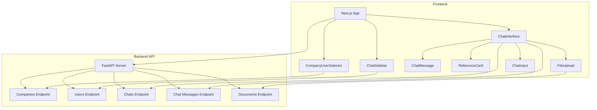

# Frontend Implementation Plan: RAG Chatbot

## Overview
Build a React + Next.js frontend for RAG chatbot with shadcn/ui components. The frontend will allow users to chat with the bot, upload documents, and view references without requiring authentication.

## Important Considerations

### 1. Future Login Migration
The frontend code will be designed to easily migrate to an authentication system later:
- **Separate Auth Context**: Create a dedicated `AuthContext` that can be extended later
- **API Client with Token Support**: Design API client to accept optional auth tokens
- **Protected Routes**: Structure routes to easily add route guards
- **User State Abstraction**: Current "selected user" pattern can be replaced with authenticated user
- **Environment Variables**: Use `NEXT_PUBLIC_API_URL` for easy backend URL configuration

### 2. Project Location
The frontend will be created in a new `frontend/` folder within base `Basic_RAG` directory:
```
Basic_RAG/
├── frontend/          # New Next.js frontend project
├── controllers/
├── layers/
├── services/
└── ...
```

## Architecture Diagram



---

## Backend Changes Required

### 1. Add GET Endpoint: Retrieve All Chats for a User
**File**: `controllers/chat.py`

```python
@router.get("/user/{user_id}", response_model=List[ChatResponse])
async def get_chats_by_user(
    user_id: UUID,
    session: Session = Depends(get_db_session)
):
    """Get all chats for a specific user."""
    try:
        chat_dao = ChatDAO(session)
        chats = chat_dao.get_chats_by_user(user_id)
        return [
            ChatResponse(
                id=chat.id,
                title=chat.title,
                user_id=chat.user_id,
                company_id=chat.company_id,
                created_at=chat.created_at.isoformat(),
                updated_at=chat.updated_at.isoformat()
            )
            for chat in chats
        ]
    except Exception as e:
        raise HTTPException(status_code=500, detail=f"Failed to retrieve chats: {str(e)}")
```

### 2. Add GET Endpoint: Retrieve Messages for a Chat
**File**: `controllers/chat_messages.py`

```python
@router.get("/chat/{chat_id}", response_model=List[ChatMessageResponse])
async def get_messages_by_chat(
    chat_id: UUID,
    session: Session = Depends(get_db_session)
):
    """Get all messages for a specific chat, ordered by creation time."""
    try:
        chat_message_dao = ChatMessageDAO(session)
        messages = chat_message_dao.get_messages_by_chat_ordered(chat_id)
        return [
            ChatMessageResponse(
                id=msg.id,
                chat_id=msg.chat_id,
                chat_query=msg.chat_query,
                context_document=msg.context_document,
                response=msg.response,
                created_at=msg.created_at.isoformat()
            )
            for msg in messages
        ]
    except Exception as e:
        raise HTTPException(status_code=500, detail=f"Failed to retrieve messages: {str(e)}")
```

### 3. Add GET Endpoint: Retrieve Users Filtered by Company
**File**: `controllers/users.py`

```python
@router.get("/company/{company_id}", response_model=List[UserResponse])
async def get_users_by_company(
    company_id: UUID,
    session: Session = Depends(get_db_session)
):
    """Get all users for a specific company."""
    try:
        user_dao = UserDAO(session)
        users = user_dao.get_users_by_company(company_id)
        return [
            UserResponse(
                id=user.id,
                email=user.email,
                name=user.name,
                company_id=user.company_id,
                created_at=user.created_at.isoformat()
            )
            for user in users
        ]
    except Exception as e:
        raise HTTPException(status_code=500, detail=f"Failed to retrieve users: {str(e)}")
```

---

## Frontend Project Structure

```
frontend/
├── app/
│   ├── layout.tsx          # Root layout with providers
│   ├── page.tsx            # Main chat page
│   └── globals.css         # Global styles
├── components/
│   ├── ui/                 # shadcn/ui components
│   ├── CompanyUserSelector.tsx
│   ├── ChatSidebar.tsx
│   ├── ChatInterface.tsx
│   ├── ChatMessage.tsx
│   ├── ReferenceCard.tsx
│   ├── FileUpload.tsx
│   └── ChatInput.tsx
├── lib/
│   ├── api.ts              # API client functions
│   └── utils.ts            # Utility functions
├── hooks/
│   ├── useCompanies.ts
│   ├── useUsers.ts
│   ├── useChats.ts
│   └── useMessages.ts
├── types/
│   └── api.ts              # TypeScript types for API
├── contexts/
│   ├── AuthContext.tsx     # Auth state (for future login feature)
│   └── AppContext.tsx       # App state (company, user)
├── .env.local              # Environment variables
└── README.md              # Setup instructions
```

---

## Frontend Implementation Details

### 1. TypeScript Types (`types/api.ts`)

```typescript
// Company types
export interface Company {
  id: string;
  name: string;
  description: string | null;
  embedding_model: string;
  embedding_type: string;
  llm_model: string;
  llm_provider: string;
  created_at: string;
}

// User types
export interface User {
  id: string;
  email: string;
  name: string;
  company_id: string | null;
  created_at: string;
}

// Chat types
export interface Chat {
  id: string;
  title: string | null;
  user_id: string;
  company_id: string | null;
  created_at: string;
  updated_at: string;
}

// Chat Message types
export interface ChatMessage {
  id: string;
  chat_id: string;
  chat_query: string;
  context_document: Record<string, any> | null;
  response: string | null;
  created_at: string;
}

// Query Response types
export interface ChatQueryResponse {
  message_id: string;
  chat_id: string;
  query: string;
  response: string;
  context_documents: Record<string, any>[];
  created_at: string;
  llm_model: string;
  llm_provider: string;
}

// Document Upload types
export interface DocumentUploadResponse {
  status: string;
  document_id: string;
  filename: string;
  text_length: number;
  num_chunks: number;
  chunk_size: number;
  overlap: number;
  metadata: Record<string, any>;
  processing_info?: Record<string, any>;
}
```

### 2. API Client (`lib/api.ts`)

**Note**: Designed with optional auth token support for future authentication migration.

```typescript
const API_BASE_URL = process.env.NEXT_PUBLIC_API_URL || 'http://localhost:8000/api/v1';

// Helper function to get auth headers (for future login feature)
function getAuthHeaders(): HeadersInit {
  const headers: HeadersInit = { 'Content-Type': 'application/json' };
  // Future: Add auth token when login is implemented
  // const token = localStorage.getItem('auth_token');
  // if (token) headers['Authorization'] = `Bearer ${token}`;
  return headers;
}

// Companies
export async function fetchCompanies(): Promise<Company[]> {
  const response = await fetch(`${API_BASE_URL}/companies`, {
    headers: getAuthHeaders(),
  });
  if (!response.ok) throw new Error('Failed to fetch companies');
  return response.json();
}

// Users
export async function fetchUsers(): Promise<User[]> {
  const response = await fetch(`${API_BASE_URL}/users`, {
    headers: getAuthHeaders(),
  });
  if (!response.ok) throw new Error('Failed to fetch users');
  return response.json();
}

export async function fetchUsersByCompany(companyId: string): Promise<User[]> {
  const response = await fetch(`${API_BASE_URL}/users/company/${companyId}`, {
    headers: getAuthHeaders(),
  });
  if (!response.ok) throw new Error('Failed to fetch users');
  return response.json();
}

// Chats
export async function fetchChatsByUser(userId: string): Promise<Chat[]> {
  const response = await fetch(`${API_BASE_URL}/chats/user/${userId}`, {
    headers: getAuthHeaders(),
  });
  if (!response.ok) throw new Error('Failed to fetch chats');
  return response.json();
}

export async function createChat(userId: string, title?: string, companyId?: string): Promise<Chat> {
  const params = new URLSearchParams();
  if (title) params.append('title', title);
  if (companyId) params.append('company_id', companyId);
  
  const response = await fetch(`${API_BASE_URL}/chats/user/${userId}?${params}`, {
    method: 'POST',
    headers: getAuthHeaders(),
  });
  if (!response.ok) throw new Error('Failed to create chat');
  return response.json();
}

export async function deleteChat(chatId: string): Promise<void> {
  const response = await fetch(`${API_BASE_URL}/chats/${chatId}`, {
    method: 'DELETE',
    headers: getAuthHeaders(),
  });
  if (!response.ok) throw new Error('Failed to delete chat');
}

// Messages
export async function fetchMessagesByChat(chatId: string): Promise<ChatMessage[]> {
  const response = await fetch(`${API_BASE_URL}/chat-messages/chat/${chatId}`, {
    headers: getAuthHeaders(),
  });
  if (!response.ok) throw new Error('Failed to fetch messages');
  return response.json();
}

export async function sendQuery(
  userId: string,
  chatId: string,
  query: string,
  options?: { use_retrieval?: boolean; top_k?: number; max_history?: number }
): Promise<ChatQueryResponse> {
  const params = new URLSearchParams({ query });
  if (options?.use_retrieval !== undefined) params.append('use_retrieval', String(options.use_retrieval));
  if (options?.top_k) params.append('top_k', String(options.top_k));
  if (options?.max_history) params.append('max_history', String(options.max_history));
  
  const response = await fetch(`${API_BASE_URL}/chat-messages/query/user/${userId}/chat/${chatId}?${params}`, {
    method: 'POST',
    headers: getAuthHeaders(),
  });
  if (!response.ok) throw new Error('Failed to send query');
  return response.json();
}

// Documents
export async function uploadDocument(
  file: File,
  companyId?: string,
  userId?: string
): Promise<DocumentUploadResponse> {
  const formData = new FormData();
  formData.append('file', file);
  if (companyId) formData.append('company_id', companyId);
  if (userId) formData.append('user_id', userId);
  
  const response = await fetch(`${API_BASE_URL}/documents/upload`, {
    method: 'POST',
    body: formData,
  });
  if (!response.ok) throw new Error('Failed to upload document');
  return response.json();
}
```

### 3. AuthContext for Future Login Migration (`contexts/AuthContext.tsx`)

```typescript
'use client';

import { createContext, useContext, useState, ReactNode } from 'react';

interface User {
  id: string;
  email: string;
  name: string;
  company_id: string | null;
}

interface AuthContextType {
  user: User | null;
  isAuthenticated: boolean;
  login: (email: string, password: string) => Promise<void>;
  logout: () => void;
  // For now, we'll use a "demo mode" where user is selected via dropdown
  setDemoUser: (user: User | null) => void;
}

const AuthContext = createContext<AuthContextType | undefined>(undefined);

export function AuthProvider({ children }: { children: ReactNode }) {
  const [user, setUser] = useState<User | null>(null);

  const login = async (email: string, password: string) => {
    // Future: Implement actual login API call
    // const response = await fetch('/api/auth/login', { ... });
    // setUser(response.user);
  };

  const logout = () => {
    setUser(null);
    localStorage.removeItem('auth_token');
  };

  const setDemoUser = (demoUser: User | null) => {
    setUser(demoUser);
  };

  return (
    <AuthContext.Provider
      value={{
        user,
        isAuthenticated: !!user,
        login,
        logout,
        setDemoUser,
      }}
    >
      {children}
    </AuthContext.Provider>
  );
}

export function useAuth() {
  const context = useContext(AuthContext);
  if (!context) throw new Error('useAuth must be used within AuthProvider');
  return context;
}
```

**Migration Path**: When login is added:
1. Replace `setDemoUser` calls with actual `login` function
2. Add token storage in localStorage
3. Update API client to include auth headers
4. Add route guards for protected pages
5. Replace CompanyUserSelector with login form

### 4. AppContext for Managing Selected Company and User (`contexts/AppContext.tsx`)

```typescript
'use client';

import { createContext, useContext, useState, ReactNode } from 'react';
import { Company, User } from '@/types/api';

interface AppContextType {
  selectedCompany: Company | null;
  selectedUser: User | null;
  setSelectedCompany: (company: Company | null) => void;
  setSelectedUser: (user: User | null) => void;
}

const AppContext = createContext<AppContextType | undefined>(undefined);

export function AppProvider({ children }: { children: ReactNode }) {
  const [selectedCompany, setSelectedCompany] = useState<Company | null>(null);
  const [selectedUser, setSelectedUser] = useState<User | null>(null);

  return (
    <AppContext.Provider
      value={{
        selectedCompany,
        selectedUser,
        setSelectedCompany,
        setSelectedUser,
      }}
    >
      {children}
    </AppContext.Provider>
  );
}

export function useApp() {
  const context = useContext(AppContext);
  if (!context) throw new Error('useApp must be used within AppProvider');
  return context;
}
```

### 5. Custom Hooks

#### `hooks/useCompanies.ts`
```typescript
import { useState, useEffect } from 'react';
import { fetchCompanies } from '@/lib/api';
import { Company } from '@/types/api';

export function useCompanies() {
  const [companies, setCompanies] = useState<Company[]>([]);
  const [loading, setLoading] = useState(true);
  const [error, setError] = useState<string | null>(null);

  useEffect(() => {
    fetchCompanies()
      .then(setCompanies)
      .catch((err) => setError(err.message))
      .finally(() => setLoading(false));
  }, []);

  return { companies, loading, error };
}
```

#### `hooks/useUsers.ts`
```typescript
import { useState, useEffect } from 'react';
import { fetchUsers, fetchUsersByCompany } from '@/lib/api';
import { User } from '@/types/api';

export function useUsers(companyId?: string) {
  const [users, setUsers] = useState<User[]>([]);
  const [loading, setLoading] = useState(true);
  const [error, setError] = useState<string | null>(null);

  useEffect(() => {
    const fetchFn = companyId ? () => fetchUsersByCompany(companyId) : fetchUsers;
    fetchFn()
      .then(setUsers)
      .catch((err) => setError(err.message))
      .finally(() => setLoading(false));
  }, [companyId]);

  return { users, loading, error };
}
```

#### `hooks/useChats.ts`
```typescript
import { useState, useEffect } from 'react';
import { fetchChatsByUser, createChat, deleteChat } from '@/lib/api';
import { Chat } from '@/types/api';

export function useChats(userId: string | null) {
  const [chats, setChats] = useState<Chat[]>([]);
  const [loading, setLoading] = useState(false);
  const [error, setError] = useState<string | null>(null);

  const refresh = async () => {
    if (!userId) return;
    setLoading(true);
    try {
      const data = await fetchChatsByUser(userId);
      setChats(data);
    } catch (err) {
      setError(err instanceof Error ? err.message : 'Failed to fetch chats');
    } finally {
      setLoading(false);
    }
  };

  const createNewChat = async (title?: string, companyId?: string) => {
    if (!userId) throw new Error('No user selected');
    const newChat = await createChat(userId, title, companyId);
    setChats((prev) => [newChat, ...prev]);
    return newChat;
  };

  const removeChat = async (chatId: string) => {
    await deleteChat(chatId);
    setChats((prev) => prev.filter((c) => c.id !== chatId));
  };

  useEffect(() => {
    refresh();
  }, [userId]);

  return { chats, loading, error, refresh, createNewChat, removeChat };
}
```

#### `hooks/useMessages.ts`
```typescript
import { useState, useEffect } from 'react';
import { fetchMessagesByChat, sendQuery } from '@/lib/api';
import { ChatMessage, ChatQueryResponse } from '@/types/api';

export function useMessages(chatId: string | null) {
  const [messages, setMessages] = useState<ChatMessage[]>([]);
  const [loading, setLoading] = useState(false);
  const [sending, setSending] = useState(false);
  const [error, setError] = useState<string | null>(null);

  const refresh = async () => {
    if (!chatId) return;
    setLoading(true);
    try {
      const data = await fetchMessagesByChat(chatId);
      setMessages(data);
    } catch (err) {
      setError(err instanceof Error ? err.message : 'Failed to fetch messages');
    } finally {
      setLoading(false);
    }
  };

  const sendMessage = async (userId: string, query: string) => {
    if (!chatId) throw new Error('No chat selected');
    setSending(true);
    try {
      const response = await sendQuery(userId, chatId, query);
      // Add the new message to the list
      const newMessage: ChatMessage = {
        id: response.message_id,
        chat_id: response.chat_id,
        chat_query: response.query,
        context_document: { documents: response.context_documents },
        response: response.response,
        created_at: response.created_at,
      };
      setMessages((prev) => [...prev, newMessage]);
      return response;
    } catch (err) {
      setError(err instanceof Error ? err.message : 'Failed to send message');
      throw err;
    } finally {
      setSending(false);
    }
  };

  useEffect(() => {
    refresh();
  }, [chatId]);

  return { messages, loading, sending, error, refresh, sendMessage };
}
```

### 6. UI Components

#### `components/CompanyUserSelector.tsx`
- Dropdowns for selecting company and user
- User dropdown is filtered by selected company
- Loading states and error handling

#### `components/ChatSidebar.tsx`
- List of user's chats
- Create new chat button
- Delete chat button
- Shows relative time (using date-fns)

#### `components/ChatInterface.tsx`
- Main chat area with message display
- Auto-scroll to latest message
- Loading indicator when sending
- Empty state when no chat selected

#### `components/ChatMessage.tsx`
- User messages aligned right
- Bot messages aligned left
- Avatar icons for user/bot
- Reference cards displayed below bot messages
- Timestamp for each message

#### `components/ReferenceCard.tsx`
- Shows document metadata (filename, similarity score)
- Truncated content preview
- Badge showing match percentage

#### `components/FileUpload.tsx`
- PDF file upload with progress indicator
- Multiple file support
- Success/error status for each file
- Clear results button

#### `components/ChatInput.tsx`
- Textarea for message input
- Send button with icon
- Keyboard shortcuts (Enter to send, Shift+Enter for new line)
- Disabled state when sending

### 7. Main Page (`app/page.tsx`)

```typescript
'use client';

import { useState } from 'react';
import { useCompanies } from '@/hooks/useCompanies';
import { useUsers } from '@/hooks/useUsers';
import { useChats } from '@/hooks/useChats';
import { useMessages } from '@/hooks/useMessages';
import { useApp } from '@/contexts/AppContext';
import { useAuth } from '@/contexts/AuthContext';
import { CompanyUserSelector } from '@/components/CompanyUserSelector';
import { ChatSidebar } from '@/components/ChatSidebar';
import { ChatInterface } from '@/components/ChatInterface';

function ChatPage() {
  const { selectedCompany, selectedUser, setSelectedCompany, setSelectedUser } = useApp();
  const { setDemoUser } = useAuth();
  const { companies } = useCompanies();
  const { users } = useUsers(selectedCompany?.id);
  const { chats, createNewChat, removeChat } = useChats(selectedUser?.id || null);
  const { messages, sendMessage, sending } = useMessages(selectedChatId);

  const [selectedChatId, setSelectedChatId] = useState<string | null>(null);

  const handleCompanyChange = (companyId: string) => {
    const company = companies.find((c) => c.id === companyId);
    setSelectedCompany(company || null);
    setSelectedUser(null);
    setDemoUser(null);
    setSelectedChatId(null);
  };

  const handleUserChange = (userId: string) => {
    const user = users.find((u) => u.id === userId);
    setSelectedUser(user || null);
    setDemoUser(user || null);
    setSelectedChatId(null);
  };

  const handleNewChat = async () => {
    const newChat = await createNewChat('New Chat', selectedCompany?.id);
    setSelectedChatId(newChat.id);
  };

  const handleSelectChat = (chatId: string) => {
    setSelectedChatId(chatId);
  };

  const handleSendMessage = async (query: string) => {
    if (!selectedUser) return;
    await sendMessage(selectedUser.id, query);
  };

  const selectedChat = chats.find((c) => c.id === selectedChatId);

  return (
    <div className="h-screen flex flex-col">
      <header className="border-b bg-background p-4">
        <h1 className="text-2xl font-bold">RAG Chatbot</h1>
      </header>
      <div className="flex-1 flex overflow-hidden">
        <CompanyUserSelector
          selectedCompany={selectedCompany}
          selectedUser={selectedUser}
          onCompanyChange={handleCompanyChange}
          onUserChange={handleUserChange}
        />
        <ChatSidebar
          selectedChatId={selectedChatId}
          chats={chats}
          onSelectChat={handleSelectChat}
          onNewChat={handleNewChat}
          onDeleteChat={removeChat}
        />
        <ChatInterface
          chatId={selectedChatId}
          messages={messages}
          sending={sending}
          onSendMessage={handleSendMessage}
        />
      </div>
    </div>
  );
}

export default ChatPage;
```

### 8. Root Layout (`app/layout.tsx`)

```typescript
import type { Metadata } from 'next';
import { Inter } from 'next/font/google';
import './globals.css';
import { AuthProvider } from '@/contexts/AuthContext';
import { AppProvider } from '@/contexts/AppContext';

const inter = Inter({ subsets: ['latin'] });

export const metadata: Metadata = {
  title: 'RAG Chatbot',
  description: 'Chat with your documents using RAG',
};

export default function RootLayout({
  children,
}: {
  children: React.ReactNode;
}) {
  return (
    <html lang="en">
      <body className={inter.className}>
        <AuthProvider>
          <AppProvider>
            {children}
          </AppProvider>
        </AuthProvider>
      </body>
    </html>
  );
}
```

---

## Setup Instructions

### 1. Initialize Next.js Project (in Basic_RAG directory)
```bash
# From Basic_RAG directory
npx create-next-app@latest frontend --typescript --tailwind --eslint --app --src-dir=false --import-alias="@/*" --use-npm
```

### 2. Install Dependencies
```bash
cd frontend
npm install lucide-react date-fns clsx tailwind-merge
npm install @radix-ui/react-slot @radix-ui/react-select @radix-ui/react-scroll-area @radix-ui/react-avatar @radix-ui/react-progress class-variance-authority
```

### 3. Create Environment Variables
Create `frontend/.env.local`:
```env
NEXT_PUBLIC_API_URL=http://localhost:8000/api/v1
```

### 4. Run Development Server
```bash
cd frontend
npm run dev
```

The frontend will be available at `http://localhost:3000`

---

## Summary

This implementation provides a complete frontend for the RAG chatbot with:

### Backend Changes ✅
- [x] Added `GET /api/v1/chats/user/{user_id}` - Retrieve all chats for a user
- [x] Added `GET /api/v1/chat-messages/chat/{chat_id}` - Retrieve messages for a specific chat
- [x] Added `GET /api/v1/users/company/{company_id}` - Retrieve users filtered by company

### Frontend Implementation ✅
- [x] Next.js project initialized with TypeScript and Tailwind CSS
- [x] shadcn/ui components installed and configured
- [x] Project structure created (components, lib, types, hooks, contexts)
- [x] TypeScript types for API responses
- [x] API client utility functions with auth support for future login
- [x] AuthContext for future login migration
- [x] AppContext for managing selected company and user
- [x] Custom hooks for data fetching (useCompanies, useUsers, useChats, useMessages)
- [x] CompanyUserSelector component (dropdowns)
- [x] ChatSidebar component (list of user's chats)
- [x] ChatMessage component (display user/bot messages)
- [x] ReferenceCard component (display context documents)
- [x] FileUpload component (PDF upload with progress)
- [x] ChatInput component (message input with send button)
- [x] ChatInterface component (main chat area)
- [x] Main page layout integrating all components
- [x] Environment configuration (.env.local)
- [x] README with setup instructions

### Key Features Implemented
1. ✅ **Company/User Selection**: Dropdown selectors without login requirement
2. ✅ **Chat Interface**: Real-time messaging with bot responses
3. ✅ **Chat History**: User-wise chat history maintained
4. ✅ **File Upload**: PDF file upload for embedding
5. ✅ **Reference Display**: Show context documents used for bot responses
6. ✅ **Future-Ready**: Designed for easy migration to authentication system

### Design Decisions for Future Login Migration

| Aspect | Current Implementation | Future Migration Path |
|---------|---------------------|---------------------|
| User Selection | Dropdown selector | Replace with login form |
| Auth State | `AppContext` with selected user | `AuthContext` with authenticated user |
| API Calls | No auth headers | Add Bearer token from `AuthContext` |
| Protected Routes | None | Add route guards with middleware |
| Token Storage | None | localStorage for JWT tokens |

### Frontend Location
The frontend has been created in `Basic_RAG/frontend/` directory, keeping it separate from backend code.

### Remaining Tasks
- [ ] Install dependencies and run development server
- [ ] Test all features end-to-end
- [ ] Add responsive design for mobile/desktop
